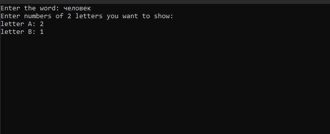

### The Gallows

1) Начало программы и выбор режима игры

2) выбрасывается рандомное слово из  txt файла и открываются 2 рандомные буквы

3) При вводе правильной буквы она становится на свое место

4) Неверно вводим буквы

5) Перезапускаем игру и выбираем 2й режим

6) 1-й игрок вводит слово и выбирает  какие по счету буквы открыть

7) Вводим верные буквы и открываемвсе слово

