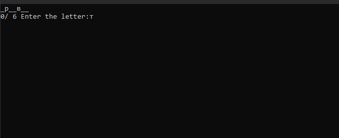
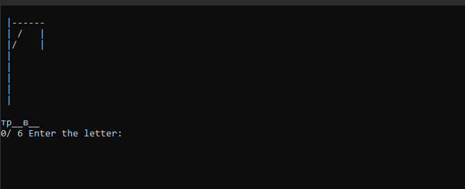
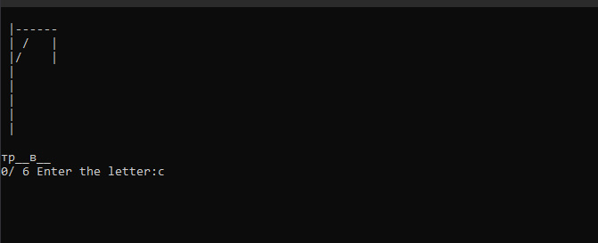
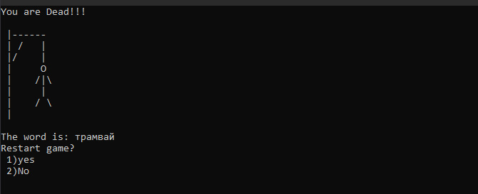
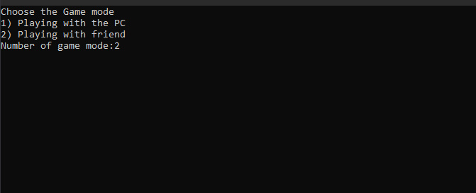
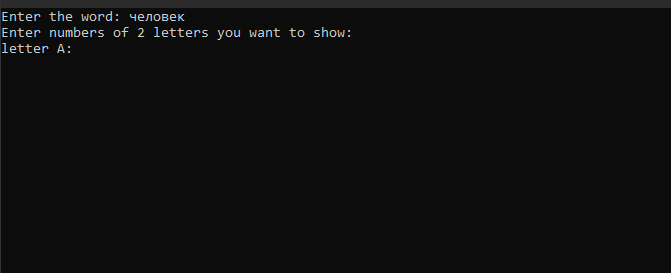
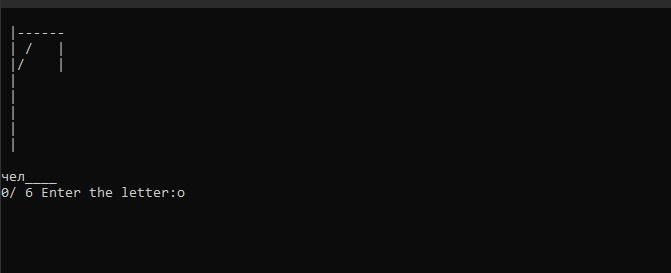
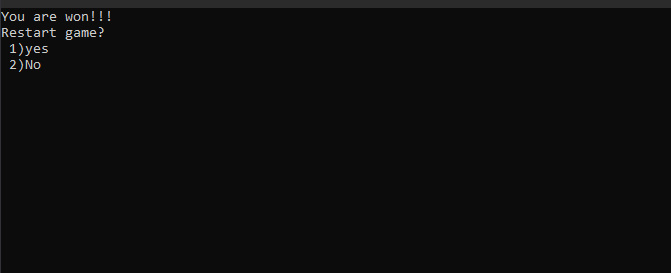

### The Gallows

1)Начало программы и выбор режима игры

2)выбрасывается рандомное слово из  txt файлаи открываются 2 рандомные буквы

3)при вводе правильной буквы она становится на свое место

4)неверно вводим буквы

5)перезапускаем игру и выбираем 2й режим

6) 1й игрок вводит слово и выбирает  какие по счету буквы открыть

7)вводим верные буквы и открываемвсе слово

